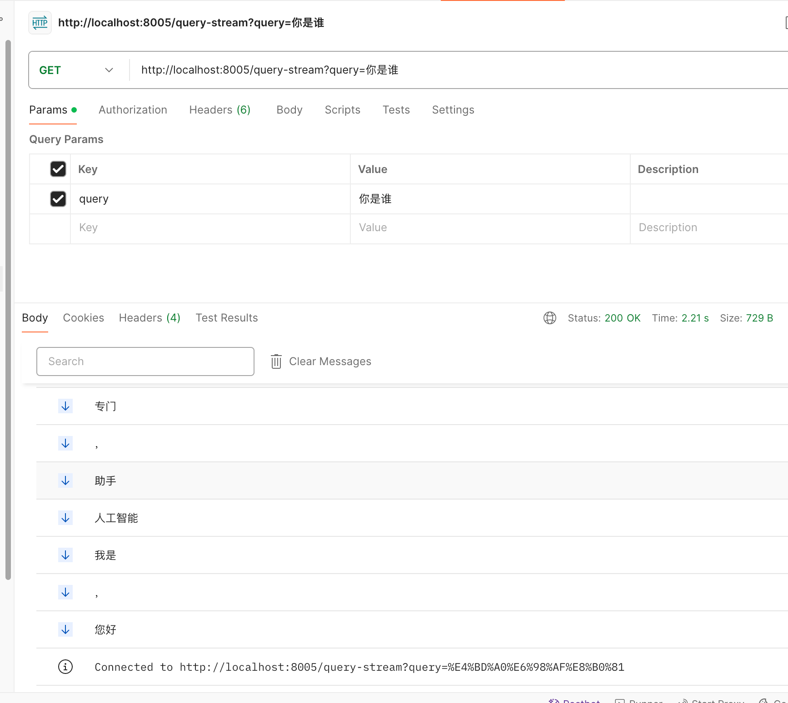

# 1. 概述
时间：2.25.1.7 记录
该项目迭代版本旨在学习haystack-ai 2.4.0 搭建简单rag，实现流式输出的问答请求的解决方案。

# 2. 目录版本介绍
1. v1: 只在web.py中实现了简单的haystack-ai的rag流程和问答流程，不能流式问答。
2. v2: 在 v1 的基础上，对大模型组件进行了自定义继承和改进。
分水岭
3. v3: 在 v2 的基础上，异步队列私有化，实现了基本的流式输出和非流式输出。-----基础版本。
4. v4: 在 v3 的基础上，将 ChatGLM 和 DocumentToPrompt 简单提取了出来。私有队列还是没有动。v3是最开始迭代版本。
5. v5: 在 v4 的基础上，将 rag 管道的代码抽取成了 rag.py 文件。web.py 文件只有请求的端口。将回调函数整合到了 startRag中。

v5的版本基本上可以进行嫁接到自己haystack项目上。该项目是一个解决方案。


# 3. 项目启动流程
全局 python 环境 3.11.5

1. 配置 ChatGlm 全局的 api-key 变量，api-key值是从 智谱开放平台上([https://open.bigmodel.cn/](https://open.bigmodel.cn/)) 申请即可。
    ```bash
    vim ~/.bash_profile
    export CHATGLM_API_KEY="09**************************************Ao"
    source ~/.bash_profile
    ```

2. 创建python环境、进入环境
    在项目根目录下执行如下命令：
    ```bash
    python -m venv venv
    source venv/bin/activate
    ```
3. 安装依赖
    ```bash
    pip install -i https://pypi.tuna.tsinghua.edu.cn/simple -r requirements.txt
    ```
4. 启动项目
    ```bash
    # 启动v1
    cd src/v1
    nohup uvicorn web:app --host 0.0.0.0 --port 8000 --reload &
    # 启动v2
    cd src/v2
    nohup uvicorn web2:app --host 0.0.0.0 --port 8002 --reload > nohup2.out 2>&1 &

    # 启动v3
    cd src/v3
    nohup uvicorn web3:app --host 0.0.0.0 --port 8003 --reload > nohup3.out 2>&1 &

    # 启动v4
    cd src/v4
    nohup uvicorn web4:app --host 0.0.0.0 --port 8004 --reload > nohup4.out 2>&1 &

    # 启动v5
    cd src/v5
    nohup uvicorn web5:app --host 0.0.0.0 --port 8005 --reload > nohup5.out 2>&1 &
    ```

5. 请求测试
    ```bash
    # 非流式请求
    http://localhost:8005/query-no-stream?query=你是谁
    ```
    输出
    ```json
    {
        "answer": "您好，我是一名高中语文老师。很高兴为您解答高中语文相关的问题，包括文学常识、文言文阅读、现代文阅读、作文指导等方面。请问有什么可以帮助您的？"
    }
    ```

    ```bash
    # 流式请求
    http://localhost:8005/query-stream?query=以秋天为题写1000字作文
    ```
    输出
    

# 4. 版本
1. python 版本 3.11.5
2. haystack-ai:2.4.0 ,当前最新的是2.9。
3. 其他版本看 requirements.txt 即可